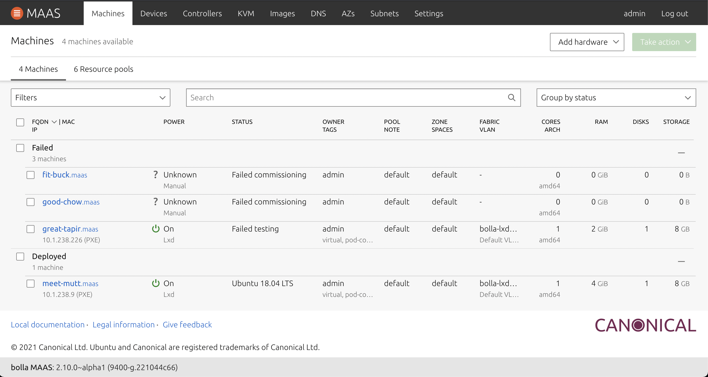
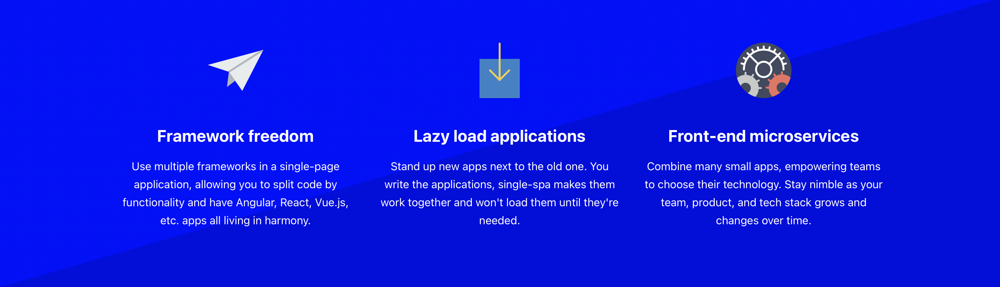

# Building a cross-framework UI with single-spa in MAAS 2.8

In MAAS 2.8, we’re shipping a new machine list, built from the ground up in React and Redux. We’ve also implemented a few new features: persisting UI state for grouping, new grouping options, bookmarkable urls with filter and search parameters, and many performance improvements.

In my last post, [Migrating the MAAS UI from AngularJS to React](https://ubuntu.com/blog/migrating-the-maas-ui-from-angularjs-to-react), I touched upon our decision to avoid building a single hybridised UI using tools such as [react2angular](https://github.com/coatue-oss/react2angular) and instead create a new react-redux application. This was the correct decision in retrospect, however it poses some new challenges, particularly around ensuring good user experience while navigating between both React and AngularJS apps.

## SingleSPA

In order to provide a single, unified experience as we continue our migration to React beyond the new machine list, we’ve employed a framework called [single-spa](https://single-spa.js.org/), “a javascript router for front-end microservices”. Single-spa allows us to create a single production build for the MAAS UI, while preserving our independent React and AngularJS projects, each with their own distinct codebase, build, configuration and CI.

As users navigate between React and AngularJS routes in the MAAS UI, each respective app is lazily loaded. Once loaded, both apps remain in memory, and navigating between the two feels relatively seamless without any loss of state.

Single-spa was originally conceived to address essentially the same issue that MAAS faces, a means of migrating from a legacy AngularJS monolith to an AngularJS and React polyglot application. Since then, it has grown in scope to provide tooling for building frontend microservices. Frontend microservices, or micro-frontends are an advanced architectural pattern, allowing for independent deployment and scaling of web application development across disparate teams. Many of the benefits conferred by micro-frontends are not relevant for MAAS, which our simpler use of single-spa reflects.

### Migrating our apps to single-spa

Single-spa delivers on its promise, however adopting it for an existing application can be a complex process as the tools are flexible and support a variety of build and deployment scenarios. New applications, particularly those wanting to adopt the frontend microservices pattern, should consider using the [recommended setup](https://single-spa.js.org/docs/recommended-setup) with the SystemJS module loader and the create-single-spa cli tool. SystemJS allows for importing of independently deployed bundles via an import map, a map of import names to urls. As MAAS is a packaged product, rather than a publically deployed web service, we choose not to introduce this additional complexity and instead import modules directly from within our monorepo.

Single-spa introduces lifecycle events such as mounting and unmounting of applications, similar to those in React, and provides helper libraries for popular frameworks to make your applications lifecycle aware (e.g. single-spa-angularjs, single-spa-react). While implementing single-spa lifecycle functions are straightforward, changes to your build to support single-spa can be complex, particularly if you’re using create-react-app. Additionally, single-spa applications are html-less, and the lack of an index.html to bootstrap your application may mean a bit of leg-work to get css, fonts and external script dependencies working again.

Fortunately, the open-source community and single-spa core team are very responsive to questions and [happy to help](https://single-spa.js.org/help/).

## Next steps

With the single-spa implementation complete, we’ll be continuing our migration to React, and building new features, such as support for LXD VMs. In the short to mid term, our intention is to migrate the entirety of the MAAS UI to React-Redux, however single-spa gives us the flexibility to adopt new tools should we need them in the future.

Finally, I’d like to thank [Joel Denning](https://github.com/joeldenning), a tireless advocate for open-source and the single-spa project, for his kind support.

_This article originally posted on [ubuntu.com](https://ubuntu.com/blog/building-a-cross-framework-ui-with-single-spa-in-maas-2-8)_
